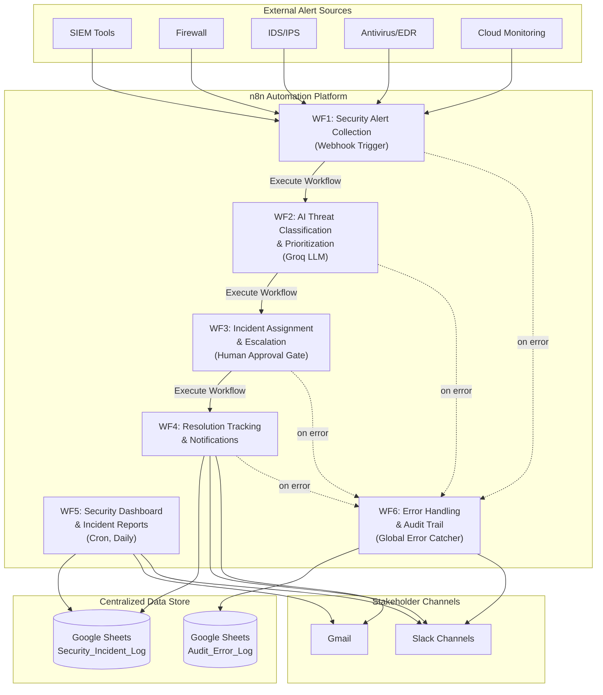
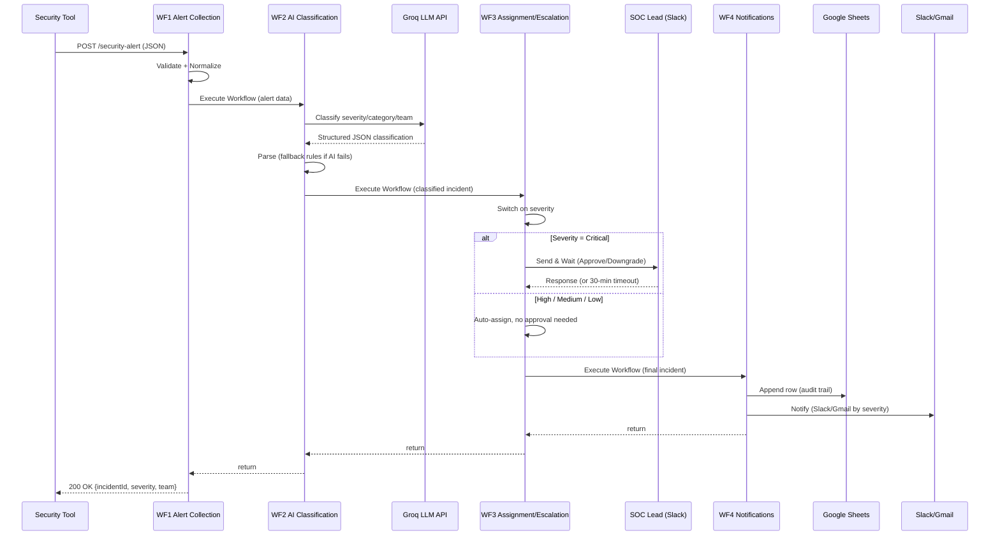

# Workflow Architecture
## AI-Powered Cyber Security Incident Response Platform

### 1. Overall System Architecture

The platform is built as **6 independent, modular n8n workflows** that chain together via `Execute Workflow` calls, plus one cron-scheduled reporting workflow and one always-on error handler. This mirrors microservice design: each workflow has one responsibility, can be tested/deployed independently, and can be swapped out (e.g., replace Groq with another LLM) without touching the rest of the pipeline.

### 2. Workflow Interaction Diagram

Each workflow is triggered either externally (webhook, cron) or internally (Execute Workflow call carrying the incident JSON forward). Data accumulates as it passes through the chain — each workflow adds fields to the same JSON object.

### 3. Event Flow Between Workflows

| From | To | Trigger Mechanism | Data Passed |
|---|---|---|---|
| External tool | WF1 | HTTP POST webhook | Raw alert JSON |
| WF1 | WF2 | Execute Workflow (sync, waits for result) | Normalized alert + incidentId |
| WF2 | Groq API | HTTP Request (with retry x3) | Alert description/context |
| WF2 | WF3 | Execute Workflow (sync) | Alert + severity/category/team/SLA |
| WF3 | Slack (human) | Send & Wait (only if Critical) | Approval prompt, 30 min timeout |
| WF3 | WF4 | Execute Workflow (sync) | Final incident record + approval status |
| WF4 | Google Sheets | Append row | Full incident record (audit trail) |
| WF4 | Slack/Gmail | Notification send | Formatted incident summary |
| WF1-WF4 | WF6 | n8n's built-in `errorWorkflow` setting | Failed execution metadata |
| Cron (8 AM daily) | WF5 | Schedule Trigger | — |
| WF5 | Google Sheets | Read all rows | Last 24h of incidents |
| WF5 | Gmail/Slack | Analytics report send | Aggregated counts, top vulnerability |

### 4. Why This Modular Split (Design Rationale)

- **WF1 (Collection)** is the only webhook-facing workflow — a single, controlled entry point simplifies security (one endpoint to authenticate/rate-limit) and input validation.
- **WF2 (Classification)** isolates the AI dependency. If Groq is swapped for another provider, only this workflow changes. It also owns retry logic and a rule-based fallback so the pipeline never hard-fails just because the LLM is down.
- **WF3 (Assignment/Escalation)** owns the human-in-the-loop gate. Keeping approval logic separate from notification logic means the approval UX can change without touching how Slack/Gmail messages are formatted.
- **WF4 (Resolution/Notifications)** is the only workflow that writes to the audit log and sends stakeholder-facing messages — a single place to change notification formatting or add new channels (e.g., MS Teams) later.
- **WF5 (Dashboard/Reports)** is fully decoupled and cron-driven — it can be changed or re-scheduled without any risk to the real-time alert pipeline.
- **WF6 (Error Handling)** is wired in as n8n's global `errorWorkflow` for WF1-WF4, so any node failure anywhere is caught centrally instead of needing duplicate error-handling logic in every workflow.
